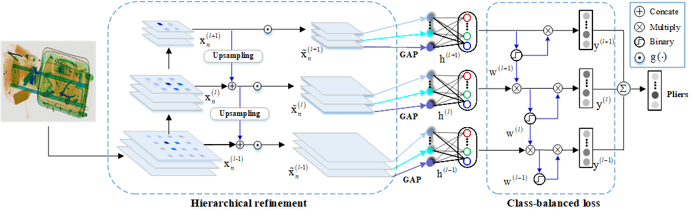

# SIXray：A Large-scale Security Inspection X-ray Benchmark for  Prohibited Item Discovery in Overlapping Images

[[Paper]](https://arxiv.org/pdf/1901.00303.pdf) [[dataset]](https://github.com/MeioJane/SIXray)



## Requirements
[Conda virtual environment](https://conda.io/docs/user-guide/tasks/manage-environments.html) is recommended: `conda env create -f environment.yml`

* Python3.5
* PyTorch: 0.3.1
* Packages: torch, numpy, tqdm 

## Usage
1. Clone the CHR repository: 
    ```bash
    git clone https://github.com/MeioJane/CHR.git
    ```

2. Run the training demo: 
    ```bash
    cd CHR/
    bash CHR/runme.sh
    ```
## Checkpoint
If you only want to test images, you can download [here](https://pan.baidu.com/s/19wuNL8KaZ5vm-yiJfu2CZA?pwd=tunq).
## Citation 
If you use the code in your research, please cite:

```bibtex
@INPROCEEDINGS{Miao2019SIXray,
    author = {Miao, Caijing and Xie, Lingxi and Wan, Fang and Su, chi and Liu, Hongye and Jiao, jianbin and Ye, Qixiang },
    title = {SIXray: A Large-scale Security Inspection X-ray Benchmark for Prohibited Item Discovery in Overlapping Images},
    booktitle = {CVPR},
    year = {2019}
}
```

## Acknowledgement
In this project, we reimplemented CHR on PyTorch based on [wildcat.pytorch](https://github.com/durandtibo/wildcat.pytorch). 


